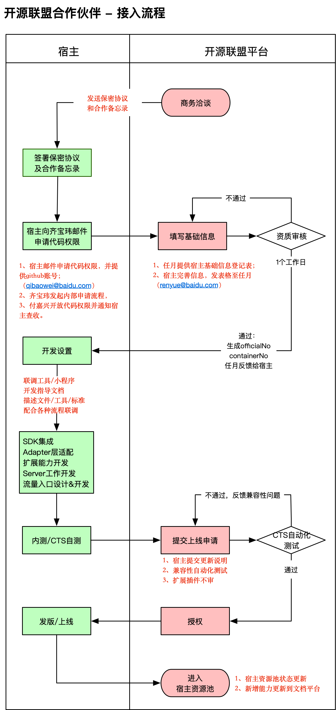

# 百度小程序开源宿主接入规范文档

> 本文档为您详细的介绍了百度小程序开源宿主接入接入文档的内容概述，和宿主 App 的整体入驻说明。

## 文档结构介绍

| 章节|内容概述 |
|-|-|
|规范说明|为您介绍入驻时需要注意的[UA规则](规范说明/UA规则.md)及[调起协议](规范说明/调起协议.md)等内容。|
|前端 swan.js 接入 |为您介绍在前端 swan.js 接入时需要进行的如下操作：[如何进行扩展](前端swan.js接入/如何进行扩展.md)、[下发与加载机制](前端swan.js接入/下发与加载机制.md)、[统计实践](前端swan.js接入/统计事件list.md)、[Demo](前端swan.js接入/Demo.md)。|
|客户端 swan-native 接入 |为您介绍客户端 swan-native 接入时，Android 和 iOS 系统分别的接入步骤、需要接入方实现的功能及服务等内容。|
|开发者工具接入|为您介绍开发者工具的[开发者工具宿主接入步骤](开发者工具相关/README.md)、[增加宿主配置](开发者工具相关/增加宿主配置.md)、[开发和调试](开发者工具相关/开发和调试.md)、[开发配置插件](开发者工具相关/开发配置插件.md)、[扩展api和组件](开发者工具相关/扩展api和组件.md)、[模拟器插件](开发者工具相关/模拟器插件.md)等内容。|
|server 端接入|为您介绍 server 端接入时[宿主方需要实现的server端接口](server端接入/README.md)、[外部接入方服务端实现建议](server端接入/advices_for_implement.md)、[内部接入方接入流程](server端接入/steps_to_register.md)、[百度智能小程序开源接入方案功能]server端接入/百度智能小程序开源接入方案.md)。|
|[CTS 测试](CTS测试/README.md)|为您介绍 CTS 测试的概念，及如何进行 CTS 测试。|

## 整体入驻说明

入驻需要进行的准备及操作：开源联盟合同签署、注册&创建宿主、开发集成、CTS测试、发布上线。

各操作关系如下图：

### 1. 开源联盟合同签署

开源联盟合同的签署首先需要宿主完成协议签订，协议包括：
 - MOU：开源联盟协议
 - NDA：开源联盟保密协议
 - 战略合作协议：开源联盟的战略合作

在宿主完成协议签订后，百度智能小程序根据MOU&NDA，百度为宿主开通Github权限。

### 2. 注册并创建宿主

前期采用线下邀请制的方式，发送至邮箱： smartprogram_union@baidu.com ，即可完成在开源联盟平台的注册和创建。

邮件模板：

	【标题】：【宿主入驻】XXX平台宿主入驻申请 
	【邮件内容】：需包含以下信息
	- 宿主资质信息：公司主体名称、营业执照;
	- 管理员信息：管理员姓名、管理员身份证号、管理员手机号、百度帐号 id;
	- 宿主信息：宿主 APP 名称（ 20 个字）、logo、基础简介（ 100 个字）。

在收到您的邮件后，我们将在 24 小时内为您反馈 officialNo 和 containerNo 用于宿主开发。

#### officialNo、containerNo 两个 id 用途：

- 用于sdk日志上传&小程序日志下载：officialNo、containerNo ；
- Sdk 设置 officialNo、 containerNo ；
- 发布扩展包，用于区分宿主扩展包时，提交 containerNo ；
- 与 Bserver 交互的部分，都需要 containerNo 。

### 3. 开发集成 

#### 在开发集成构成中，需要您进行如下行为：
 - 服务域名设置：提供宿主服务域名；
 - 开发规范信息：[UA规则](规范说明/UA规则.md)、[调起协议](规范说明/调起协议.md)、[分享](规范说明/分享.md) ；
 - 框架API、组件扩展 extension 前端接入 ；
 - 开发：完成SDK集成、Adapter适配、扩展能力开发、Server开发工作客户端swan-native接入；
 
	> 客户端第三方依赖库 [IOS](客户端swan-native接入/iOS/第三方依赖库说明.md)、[Android](客户端swan-native接入/Android/第三方依赖库说明.md)  

 - 其他 (此处需联系百度方支持 smartprogram_union@baidu.com )：

	 * 开通二维码访问时server中转白名单；
	 * 申请from（打开小程序的场景值）；
	 * extension 包发布到百度 CDN（目前手动给到百度，后续在开源联盟平台上传）。

#### 在此过程中，我们将为您提供如下服务：
 - 在开发过程中提供技术支持；
 - 完成二维码扫码流程适配；
 - 对接包审核流程。

### 4. CTS 测试

小程序 CTS是基于百度自研发的自动化测试框架和case编写完成的。大部分CTS测试集是自动执行用例，自动收集和汇总测试结果。宿主在本地执行后将App包和认证通过的测试报告上传即可。

### 5. 发布上线（不同宿主不同）

宿主需通过CTS测试后，即可进行版本的发布上线。

 --------------

 在未来我们将支持流量开发、流量分发功能：

        流量开发:宿主可以对流量入口进行设计、开发，能够支持分发小程序。
        流量分发:宿主提供流量入口的介绍、截图、API文档；百度智能小程序 将宿主流量说明上线至开发者开发文档。

