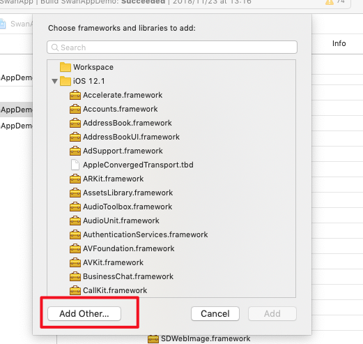

# 内部宿主接入
- [1. 简介](#1)
- [2. 开源仓库](#2)
	- [2.1. 开源demo](#21)	
	- [2.2. 工程结构](#22)
- [3. 接入步骤](#3)
	- [3.1. 依赖库引入](#31)	
	- [3.2. 资源文件引入](#32)	
	- [3.3. 环境配置](#33)	
	- [3.4. 入口调用](#34)	
	- [3.5. Adapter接口实现](#35)	
	- [3.6. Extension能力扩展](#36)	
	- [3.7. 检查关键实现接口](#37)
	- [3.8. CTS测试](#38)
- [4. 版本升级](#4)
   - [4.1. 按ChangeList升级](#41)	
   - [4.2. 替换依赖库](#42)	
   - [4.3. 替换资源文件](#43)	
- [5. 注意事项](#5)

## <span id="1"> 1. 简介</span>

小程序由三部分构成：客户端SDK(SwanNative)、前端JS SDK(SwanJS)、后端服务(Server);接入SDK需要同时处理好这三部分。

+ SwanNative：主要用于对外提供系统级能力，如视频播放、直播、弹框、登录等等。
+ SwanJS：预置在客户端SDK内部，可以通过网络自动更新，运行于SwanNative的WebView里，提供页面和组件的展示和处理逻辑。
+ Server：SwanJs和第三方开发的小程序包需要通过Server下发，登录和授权认证也需要走Server。

## <span id="2"> 2. 开源仓库</span>

> 开源仓库地址：https://github.com/swan-team/swan-ios

### <span id="21"> 2.1. 开源demo</span>

> demo中提供的Adapter具体实现，仅做为参考，宿主方需要根据自身能力实现 **必选集** 和 **可选集**Adapter。（像播放器、定位、地图、选择相册等实现仅作为参考）

### <span id="22"> 2.2. 工程结构</span>

开源工程结构可分为：

> * 小程序SDK源码：SwanAppSource （BBAMNP）
> * 小程序SDK依赖的公共库：SwanAppDependentLibs
> * 实现层：SwanAppDemo （SwanAppServices: 视频SwanVideo、地图SwanMapLib、otherLib、资源文件SwanAppResource）  
> * 生成端能力描述表脚本：scheme_desc_collector.py （宿主没有Extension扩展，不需要集成）

小程序SDK源码（BBAMNP工程），宿主方根据自身需求可选择源码或二进制库方式集成，如果源码方式集成，需要将SwanAppSource目录下文件拷贝宿主工程，选择"XCFiles/BBAMNP/BBAMNPxcodeproj"添加到宿主工程。

小程序SDK依赖的公共库：手百的基础库、开源三方库(小程序用到的解压库:ZipArchive，由于宿主的版本兼容问题，使用宿主自己的)，[详细介绍](三方库依赖说明.md)；

资源文件：小程序用到的资源文件在SwanAppResource目录下。

|文件|说明|
|:--|:--|
|BBAMNP.bundle|小程序swanCore包、小游戏swanGame包|
|BBAMNP.xcassets|小程序用到的图片|
|BBAMNPPyramid.bundle|宿主的Extension包，宿主自行替换自己的|
|BBAUIKit.bundle|小程序依赖的图片|
|BBAUIKit.xcassets|小程序依赖的图片|
|MoreMenu.xcassets|小程序的菜单栏图片|
|BBAJSBinding.plist|小游戏运行时绑定类，小游戏端能力通信采用jsBinding方式|


## <span id="3"> 3. 接入步骤</span>

### <span id="31"> 3.1. 依赖库引入</span>
* 选中target-Build Phases-点击+，选择小程序SDK依赖的公共库（SwanAppDependentLibs目录下，加上ZipArchive.framework）


* 在弹出的窗口中点击 "Add Other"
 


* 添加SwanDependLibs下的所有库


### <span id="32"> 3.2. 资源文件引入</span>

> 在SwanAppResource目录下，添加所有资源


### <span id="33"> 3.3. 环境配置</span>

> 由于小程序内部使用到了相机、相册、麦克风、定位、通讯录等权限设置，需要在宿主工程中的info.plist添加权限配置。

|权限名称|Key|说明|
|:--|:--|:--|
|相机| NSCameraUsageDescription | 使用相机的端能力：swan.camera.insert等 |
|相册| NSPhotoLibraryUsageDescription | 选择相册端能力：swan.chooseImage等 |
|麦克风| NSMicrophoneUsageDescription | 音视频录制，端能力：swan.recorder.start等 |
|通讯录| NSContactsUsageDescription | 获取手机通通讯录端能力：swan.getPhoneContacts |


### <span id="34"> 3.4. 入口调用</span>

> 初始化小程序运行时环境。

```objc
#import "AppDelegate.h"
#import <SWANManager.h>

@implementation AppDelegate

// 在AppDelegate的didFinishLaunchingWithOptions代理方法中注册小程序
- (BOOL)application:(UIApplication *)application didFinishLaunchingWithOptions:(NSDictionary *)launchOptions { 
	...
	// 【建议】在此方法入口，注册小程序运行时环境
	[SWANManager registerAppLaunchOptions:launchOptions];
}

@end

```

> 调起小程序（小游戏）方法。

参考：[小程序&小游戏调起协议](../接入步骤说明/端能力扩展.md)

```objc
// 智能小程序调起协议
NSString *appUrl = @"baiduboxapp://swan/4fecoAqgCIUtzIyA4FAPgoyrc4oUc25c";
// 调起小程序（小游戏）
[SWANManager openAppUrl:appUrl];

```

> 从宿主APP外部入口，调起小程序(分享回流、通用链接、度口令等)。

```objc
#import "AppDelegate.h"
#import <SWANManager.h>

@implementation AppDelegate

// 处理分享回流到宿主APP的小程序或者小游戏页面
- (BOOL)application:(UIApplication *)application
            openURL:(nonnull NSURL *)url
            options:(nonnull NSDictionary<UIApplicationOpenURLOptionsKey,id> *)options {
    NSString *appUrl = [url absoluteString];
    if ([appUrl containsString:@"://swan/"] ||
        [appUrl containsString:@"://swangame/"]) {
        [SWANManager openAppUrl:appUrl];
    }
    return YES;
}

@end

```

> 从宿主APP扫码入口，调起小程序。

```
1. 通过宿主app的扫码入口，得到结果：https://smartapp.baidu.com/mappconsole/api/packagescheme;
2. 宿主app的扫码入口对上面的url，进行判断打开小程序请求;
3. 调用 [[Pyramid.bba_smManager sharedInstance] generateMNPLaunchDispatcherFromURL:url];
```

### <span id="35"> 3.5. Adapter接口实现</span>

由于源码接入开源小程序，内部有些能力强依赖宿主才能运行，比如：登录功能，每家宿主都有自己的账号体系，无法使用百度passport账号登录，这时内部提供定义登录相关接口（Adapter），那么宿主就需要实现这些接口（AdapterImplement），内部就可以通过Pyramid(组件模块)调用这些接口的具体实现。还有视频播放、选择相册等能力，宿主有自己的解决方案，内部就不在提供具体实现，也需要提供接口，宿主需要实现这些接口。 

具体参考

* [小程序&小游戏Adapter分层设计](../简介/小程序&小游戏Adapter分层设计.md)
* [需要接入方实现的Adapter功能](../需要接入方实现的Adapter功能/README.md)

### <span id="36"> 3.6. Extension能力扩展</span>

宿主APP可能会swan core进行能力扩展，那就需要客户端和前端配合开发，具体功能参考 [端能力扩展](端能力扩展.md)

> [注] 百度系的内部产品线，需要将开源工程demo下的私有能力扩展（SwanExtensionPlugin）拷贝到宿主工程中；

* 【注】如果宿主没有扩展，开源仓库中提供的Extension的包文件（BBAMNPPyramid.bundle）就不需要集成到宿主工程中；
* 【注】如果宿主有私有扩展，除了写前端的Extension.js、对应宿主端上端能力方法实现外，还要对宿主端上端能力方法声明前加**端能力描述**，这样整个扩展流程才通；

### <span id="37"> 3.7. 检查关键实现接口</span>

> 设置小程序依赖的宿主根导航栈：必须要实现小程序的BBASMNavigatorAdapterProtocol的rootNavigationController接口

```objc
// 比如开源示例代码：设置宿主根导航栈，小程序根导航栈入口
+ (UINavigationController *)rootNavigationController {
    AppDelegate *appDelegate = (AppDelegate *)[[UIApplication sharedApplication] delegate];
    BBASMDemoTabBarVC *appTabBarVC = (BBASMDemoTabBarVC *)appDelegate.window.rootViewController;
    UINavigationController *appRootVC = appTabBarVC.selectedViewController;
    return appRootVC;
}
```

> 实现小程序包解压方法：必须要实现小程序的BBASMUtilAdapterProtocol的unzipFilePath接口，解压完成一定要回调finishedBlock；

```objc
// 比如开源示例代码：解压入口
+ (void)unzipFilePath:(NSString *)souPath
    toDestinationPath:(NSString *)desPath
        finishedBlock:(void (^)(BOOL bUnzip, NSString *errorDetail))finishedBlock {
    NSError *error = nil;
    NSString *errorInfo = nil;
    BOOL bSuccess = YES;
    [SSZipArchive unzipFileAtPath:souPath
                    toDestination:desPath
               preserveAttributes:NO
                        overwrite:YES
                   nestedZipLevel:0
                         password:nil
                            error:&error
                         delegate:nil
                  progressHandler:nil
                completionHandler:nil];
                ...
     // 解压完成一定要回调finishedBlock
     finishedBlock(bSuccess, errorInfo);
}
```

> 实现BBASMPlatformAdapterProtocol协议，需要检查以下接口设置参数：

* hostConfig里面的数据，来自B端平台的宿主配置信息，不是开源demo中提供的数据。其中shareCallBackUrl字段，调用分享小程序所需要的URL，不能使用demo中的URL；
* pluginDescriptionPath接口必须要实现，小程序运行时，前端API调用端能力（公共端能力swan.js+私有能力extension.js）时，需要用到这个描述表；
* 如果宿主有扩展能力，需要实现extensionRule、presetExtensionPackageBundlePath、presetExtensionPackageVersion方法；
* [注] 小程序内部需要请求配置（后期废弃），需要composeParameters （appname、osname换成宿主自己的、uid需要使用cuid）、rootServerHost、currentNetworkTypeString方法，拷贝开源demo中提供的实现；按照[公参接入说明](公参接入.md)实现公参接口;
* [注] getDeviceIdentity，获取设备唯一ID，小程序标识用户会用到。百度系的产品使用cuid库生成；
* [注] mtjCUID接口，接入了百度的mtj库，务必实现该接口；

> 实现BBASMLogAdapterProtocol协议，开源联盟签署了日志收集上报到百度服务器（默认签署）有关条款，需要将开源demo中的UBC下全部代码集成到宿主工程，不用改动；

```
// 在开源demo的SmallAppImpl/UBC(必选集)下BBASMLogAdapterProtocol
+ (void)uploadLogData:(NSArray *)logArray finishBlock:(void (^)(BOOL result))finishBlock {
     ...
}

....

```

> [注] 实现BBASMAccountAdapterProtocol协议，使用passport登录；

> [注] 实现授权：BBASMAuthorizeAdapterProtocol协议，openDataAPIKey接口中host_api_key字段获取，@刘青（手百C端servero）

> 按照[需要接入方实现的Adapter功能](../需要接入方实现的Adapter功能/README.md)的必选接口列表进行实现。

### <span id="38"> 3.8. CTS测试</span>

宿主对接小程序完成后，需要做最后的工作：CTS测试，确保宿主上实现了该有的功能。具体参考[CTS测试](../../../CTS测试/小程序小游戏cts测试.md)


## <span id="4"> 4. 版本升级</span>

宿主在更新小程序SDK时，避免不了接口、局部实现的变动，按照以下几步操作：

### <span id="41"> 4.1. 按ChangeList升级</span>
每一期SDK升级都会有对应的ChangeList说明，具体见[Change list](../Change list)

### <span id="42"> 4.2. 替换依赖库</span>
每一期SDK升级，小程序依赖库多少有更新，务必将依赖库替换。依赖库所在的目录：SwanAppDependentLibs

### <span id="43"> 4.3. 替换资源文件</span>
每一期SDK升级，小程序依赖的资源文件有更新，务必将资源文件替换。资源文件所在的目录：SwanAppDemo/Resources/SwanAppResource

## <span id="5"> 5. 注意事项</span>
对接过程中，有些需要宿主注意地方，请参考 [注意事项](../简介/注意事项.md)