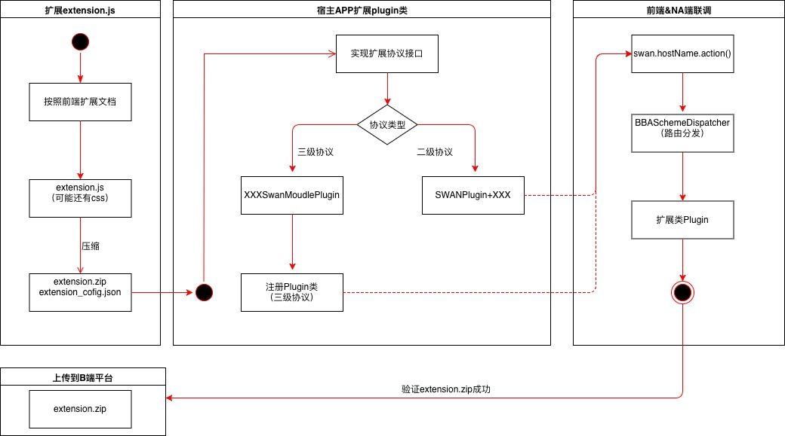
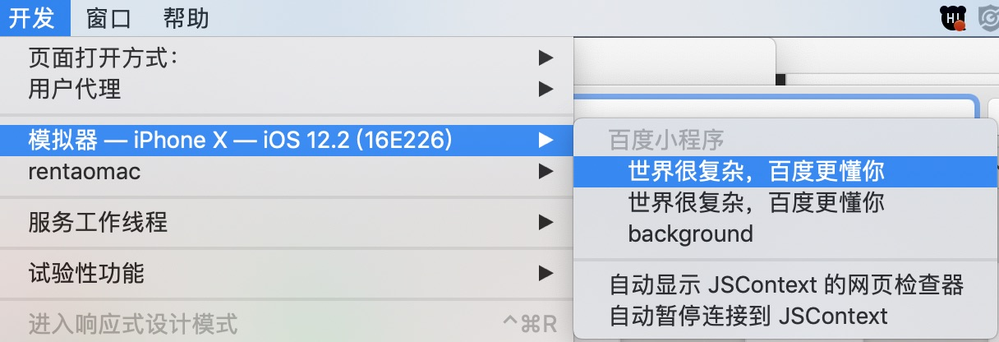
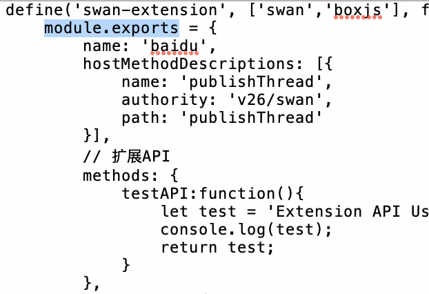

<!-- TOC -->
## 端能力扩展

- [1 文档版本](#1)

- [2 功能说明](#2)
	- [2.1 扩展介绍](#21)
	- [2.2 扩展流程](#22)
	- [2.3 协议介绍](#23)

- [3 开发指南](#3-开发指南)
	- [3.1 前端extension.js包集成](#31)
	- [3.2 实现扩展协议接口](#32)
	- [3.3 定义plugin](#33)
	- [3.4 实现plugin](#34)
	- [3.5 注册plugin](#35)
	- [3.6 端能力描述表生成](#36)
	- [3.7 联调plugin](#37)
	- [3.8 plugin命名规范](#38)

<!-- /TOC -->

--------------------------
## <span id="1"> 1 文档版本

|文档版本|修改日期|修改概述|
|:--|:--|:--|
|0.8|2018-12-17|初始版本|
|0.9|2019-05-14|更新文档|

--------------------------
## <span id="2"> 2 功能说明

### <span id="21"> 2.1 扩展介绍
宿主方根据自己的业务需求，现有swan core（swan.js）中的端能力不能满足小程序业务时，可能会对其进行功能扩展。扩展分两步工作：	

- 开发前端extension.js；
- 基于extension.js，进行NA端的端能力开发；

### <span id="22"> 2.2 扩展流程



### <span id="23"> 2.3 协议介绍

小程序中的端能力是通过协议方式进行调起的，对NA组件或模块能力的包装器，具体格式：

```

scheme://component/module/action?params=$params&callback=$callback

```

协议结构：（目前小程序业务component为<font color="red">swanAPI</font>）


* scheme为宿主方APP的协议头，能通过Custom URL Scheme方式调起宿主APP的scheme；
* component与module一起构成NA端上module，对于小程序框架component为固定值$swan$(SDK2.5.0改为$swanAPI$)，目前协议可分为<font color="red">二级协议、三级协议</font>；

  - <font color="red">二级协议</font>：component/action，对应NA端的module名为component，比如：API-获取城市省份信息，module名为swanAPI。
 
 ```
	baiduboxapp://swanAPI/getRegionData?callback=_bdbox_js_353&upgrade=0&oauthType=swan
		
 ```
 
	- <font color="red">三级协议</font>：component/module/action，对应NA端的module名为component+module，比如：组件-地图组件remove端能力，module名为swanAPIMap。
 
 ```
	baiduboxapp://swanAPI/map/remove?params={"mapId":"0","slaveId":"4"}&callback=_bdbox_js_186&upgrade=0
		
 ```

 
* action作为path的最后一级，即为端能力的方法；
* params：传递给业务的参数，包括二级回调（可能有多个二级回调）, params格式为json；

 ```
 
	如果params里面有二级回调cb（可能是其他的名称），需要根据业务，进行回调处理。
	// 二级回调成功调用，status为"0"，message为kBBASDCallBackSuccessMSG，data为字典类型
	[command doCallbackWithJSMethod:cb
                               data:@{@"status":@"0",
                      				 @"message":kBBASDCallBackSuccessMSG,
                                        @"data":dataDic}];
                               
    // 二级回调失败调用，status为"1"，message可以自己定义，data为字典类型
    [command doCallbackWithJSMethod:cb
                               data:@{@"status":@"1",
                      				 @"message":kBBASDCallBackParamsErrorMSG,
                                        @"data":dataDic}];
                                        
    
 ```

* callback：协议中的一级回调函数，端能力调用成功或失败，NA端必须进行回调；

 ```
	// 端能力调用成功
	[dispatcher doCallbackWithStatus:kBBASDCallBackSuccessStatus
                            message:kBBASDCallBackSuccessMSG
                               data:@{回传js中一级回调中所需的参数}];
                               
    // 端能力调用失败（错误类型具体参照：BBADispatcherBase.h中的定义）
    [dispatcher doCallbackWithStatus:kBBASDCallBackParamsErrorStatus
                             message:kBBASDCallBackParamsErrorMSG
                                data:@{回传js中一级回调中所需的参数解析错误等等}];
    
 ```

* upgrade：当调用协议大于NA支持最大版本号时，”1”提示升级，”0”不提示（可以废弃）。


--------------------------
## <span id="3"> 3 开发指南

### <span id="31"> 3.1 前端extension.js包集成

按照前端的[extension扩展文档](http://icode.baidu.com/repos/baidu/baiduapp/host-access-docs/blob/master:source/前端swan.js接入/如何进行扩展.md)，开发扩展前端能力，生成extension.js（可能还有extension.css）文件，对文件进行zip格式压缩为extension.zip，同时需要一个extension-config.json文件描述extenson包的版本号；宿主工程中需要预置这两个文件；

注：extension.zip包如果包含多个文件，压缩zip包时一定要注意了，在mac上选中多个文件进行压缩成zip文件，如果单独为文件夹压缩，扩展包的路径会找不到，导致扩展的端能力就调不起来。在沙箱里面的extension包的路径为:Documents/SwanCaches/swan-core-extension/preset(或者remote)/1.0.0(版本号)/（包含extension.js、extension.css）

### <span id="32"> 3.2 实现扩展协议接口
需要实现SWANPlatformProtocol协议中的以下接口：(具体实现参考开源工程的SWANPlatformImplement)

```

+ (NSString *)extensionRule;
+ (NSString *)presetSwanExtensionPackageBundlePath;
+ (NSString *)presetSwanExtensionPackageVersion;


```

### <span id="33"> 3.3 定义plugin
* 以二级协议形式进行扩展，需要对<font color="red">BBASMPlugin</font>进行类扩展（注：类扩展名务必加上宿主的前缀），moudle名为swanAPI，不需要进plugin注册，内部已注册过swanAPI这个moudle；扩展的分类名：BBASMPlugin+XXX;

* [注] 以三级协议形式进行扩展，需要继承BBASDPluginBase类，moudle名为component+module，此时需要进行手动注册plugin类，具体参考**"3.5注册plugin"**； (需要注册扩展plugin类，不然当前会视频播放无法执行)

* [注] 端能力方法名以协议中的action命名（不区分大小写）；同时需要对端能力方法按照规定格式添加**端能力描述**（必须要加，否则端能力无法调起），端能力描述按照注释方式编写；[小程序端能力开发流程文档](http://agroup.baidu.com/share/md/460369b2a5a141939e457366115a2bf9)

端能力描述模板如下：（在ES平台填写扩展端能力，端能力描述会自动生成，拷贝到NA端对应的端能力方法前）

```
/**
 * 描  述: 
 * 示  例: 调起协议
 * 文  档: 
 * 备  注:
 * ********** description ************
 * @name:      baidu.action
 * @authority: swanAPI
 * @path:      /taction
 * @args:      [{"name": "cb", "value": "string"}, {"name": "timeout", "value": "string="}, {"name": "type", "value": {"oneOf": ["weibo", "qq", "weixin", "sms"]}}]
 * @config:    {"swan": {"web": {"invoke": "swan.message.url", "handler": "bridge"}, "jsc": {"invoke": "swan.method.url", "method": "_naSwan.bridge.postMessage"}}}
 */

```


比如(二级协议)：第三方登录

```
协议：baiduboxapp://swanAPI/thirdPartyLogin?params={"cb":"_bdbox_pjs_923","type":"qq"}&callback=__jsna_30

moudle名：swanAPI
plugin类：BBASMPlugin+PrivateLogin

端能力（方法）描述：
/**
 * 描  述: 小程序第三方登录能力thirdPartyLogin
 * 示  例: baiduboxapp://swanAPI/thirdPartyLogin?params={"cb":"_bdbox_pjs_923","type":"qq"}&callback=__jsna_30
 * 文  档: http://ft.baidu.com/#/scheme/swan_thirdpartylogin
 * 备  注:
 * ********** description ************
 * @name:      baidu.thirdPartyLogin
 * @authority: swanAPI
 * @path:      /thirdPartyLogin
 * @args:      [{"name": "cb", "value": "string"}, {"name": "timeout", "value": "string="}, {"name": "type", "value": {"oneOf": ["weibo", "qq", "weixin", "sms"]}}]
 * @config:    {"swan": {"web": {"invoke": "swan.message.url", "handler": "bridge"}, "jsc": {"invoke": "swan.method.url", "method": "_naSwan.bridge.postMessage"}}}
 */
- (void)pushThread:(BBASchemeDispatcher *)dispatcher;

```

比如(三级协议)：视频播放

```

协议：baiduboxapp://swanAPI/video/play?params={"slaveId":"1","videoId":"1"}&callback=_bdbox_js_186&upgrade=0

moudle名：swanAPIVideo (需要注册扩展plugin类，不然当前会视频播放无法执行)
plugin类：BBASMVideoPlugin，端能力方法为：

端能力（方法）描述：
/**
 * 描  述: 小程序视频组件开始播放
 * 示  例: baiduboxapp://swanAPI/video/play?params={"slaveId":"1","videoId":"1"}&callback=_bdbox_js_186&upgrade=0
 * 文  档: http://ft.baidu.com/#/scheme/swan_video_play
 * 备  注:
 * ********** description ************
 * @name:      video.play
 * @authority: swanAPI
 * @path:      /video/play
 * @args:      [{"name": "videoId",  "value": "string"},  {"name": "slaveId",  "value": "string"}]
 * @config:    {"swan": {"web": {"invoke": "swan.message.url", "handler": "bridge"}, "jsc": {"invoke": "swan.method.url", "method": "_naSwan.bridge.postMessage"}}}
 */
- (void)play:(BBASchemeDispatcher *)dispatcher;
```

* 端能力中的方法均为对象方法。


### <span id="34"> 3.4 实现plugin


```
- (void)play:(BBASchemeDispatcher *)dispatcher {
	// 校验协议传递过来的字段非法或某些条件不满足时
	{
		[dispatcher doCallbackWithStatus:kBBASDCallBackParamsErrorStatus
                                 message:kBBASDCallBackParamsErrorMSG
                                    data:@{回传js中一级回调中所需的参数}];
       return;
    }
    
    // 当前这个端能力如果调用成功，需要执行一级回调
    {
    	[dispatcher doCallbackWithStatus:kBBASDCallBackSuccessStatus
                                 message:kBBASDCallBackSuccessMSG
                                    data:@{回传js中一级回调中所需的参数}];
    }
    
    // 如果协议里面的param包含有二级回调cb，需要执行二级回调
    {
    	// 业务执行成功
    	{
    		[command doCallbackWithJSMethod:cb
                               		   data:@{@"status":@"0",
                      				         @"message":kBBASDCallBackSuccessMSG,
                                                @"data":dataDic}];
    	}
    	
    	// 业务执行失败
    	{
    		[command doCallbackWithJSMethod:cb
                               		   data:@{@"status":@"1",
                      				         @"message":kBBASDCallBackParamsErrorMSG,
                                                @"data":dataDic}];
    	}
    }
}

```

### <span id="35"> 3.5 注册plugin
以三级协议形式进行的plugin扩展，是需要手动注册，宿主方需要写一个类实现BBPModuleProtocol协议，同时必须实现- (void)moduleRegister:(BBPContext *)context协议方法，在该方法体中调用registerPluginWithModule(plugin类, moudle名)；moudle不能重复注册，一个moudle对应一个具体的plugin类；

注：module名不区分大小写，module获取方式，以"swanAPI/moudle/action"为例，module名：swanAPImoudle。

比如：

```

// 扩展能力的module，需要在这个类注册；
// BBASMImplementModule.h 文件
@interface BBASMImplementModule : NSObject<BBPModuleProtocol>

@end

---------------------------------------------------------------

// BBASMImplementModule.m 文件
ModuleDefine(BBASMImplementModule)
@implementation BBASMImplementModule

- (void)moduleRegister:(BBPContext *)context {
    // 注册宿主扩展的端能力，moudle与plugin类一一对应
    registerPluginWithModule(BBASMVideoPlugin, @"swanAPIVideo");
}


```

### <span id="36"> 3.6 端能力描述表生成
具体参考文档：[端能力描述表](端能力描述表生成.md)

### <span id="37"> 3.7 联调plugin
前面所有的工作都做完了，运行宿主APP（真机、模拟器都可以），打开一个小程序，在浏览器的菜单选择“开发”选项，如图：



- 找到当前小程序的正在运行的salve页面，title名字：世界很复杂，百度更懂你；
- 在当前页面的控制台下，输入swan.hostName.action()，hostName是extension.js里面module.exports下的name（宿主方的hostName），"baidu"作为手百这边的hostName，action是hostMethodDescriptions节点下的name，比下图为例，要调用NA端的publishThread能力，在控制台上，调用方式：swan.baidu.publishThread()，回车，通过NA端上的BBASchemeDispatcher（有提供源码联调）协议分发，如果找到NA端上的publishThread的方法调用，说明扩展功能已经打通。




### <span id="38"> 3.8 plugin命名规范

- 按照前端的[extension扩展文档](http://icode.baidu.com/repos/baidu/baiduapp/host-access-docs/blob/master:source/前端swan.js接入/如何进行扩展.md)，编写extension.js;
- 建议NA端上扩展的plugin类命名：BBASMXXPlugin；

