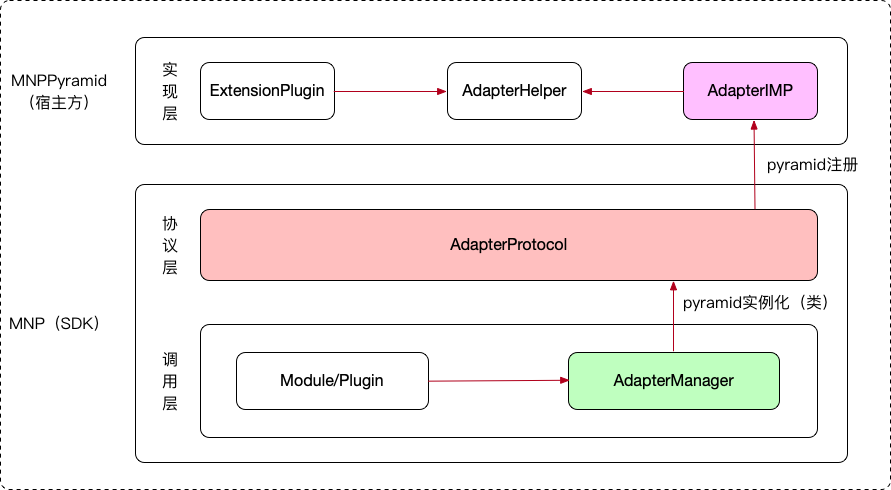

# 小程序&小游戏Adapter分层设计

## 一、设计概述
### 背景

 1. 小程序外部（MNPPyramid工程）模块，需要用到AdapterIMP接口具体实现，会直接使用AdapterIMP的类，也会通过Pyramid方式调用（MNP工程）协议方式，调取方式混乱；
 2. 小程序内部（MNP工程）模块，通过Pyramid方式调用（MNP工程）协议方式，接口分散调取，如果接口协议接口变化，没有中间件管理调用AdapterProtocol的实现，所调之处都需要调整代码；

### 原则

 1. 功能类聚：相关功能的接口封装在一个protocol里面；
 2. 职责单一：一个protocol方法，只做一件事；
 3. 单向调用： 小程序&小游戏内部提供Adapter的接口，是为了让宿主方（MNPPyramid仓库）实现这些接口，内部（MNP工程）通过Pyramid方式进行注册、调用；
 4. 中间件化：实现层+协议层+中间件+调用层，隔离调用层与协议层；

### 目的

 1. 减少Adapter接口变动的适配工作；
 2. 统一中间件方式调用Adapter接口；

## 二、设计结构


## 三、具体调用 （参考BBASMAccoutAdapterProtocol）

 1. 在MNP层，通过对应的AdapterManager（中间件）管理AdapterProtocol的实现类，调用实现的协议接口；
 2. 在MNPPyramid层，可通过自行封装的AdapterHelper类进行调用；
 
## 四、代码规范

 1. 提供的Adapter的protocol名称，均以"<font color=red>BBASM</font>"为前缀，以"<font color=red>AdapterProtocol</font>"为后缀；
 2. 提供的方法参数、返回值尽量使用OC的基本数据类型、对象类型，例如：NSInteger、NSDictionary等；
 3. 提供的方法参数里面包含Block，建议不要用定义的名字表示返回类型，例如：

```
    +  (void)login:(SMLoginCallback)loginCompletionBlock;  // 不建议
    +  (void)login:(void (^)(BOOL success))loginCompletionBlock; // 建议
```    
 4. 方法名、参数名、属性名不得包含“<font color=red>swan</font>（不管大小写）”；
 5. 明确方法是否为@optional，标注原因;
 6. 对于不开放的protocol、interface，注释前标记为**private : 手百可用（或者百度系产品可用）**;