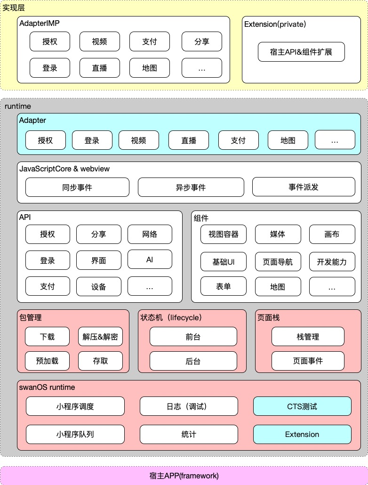
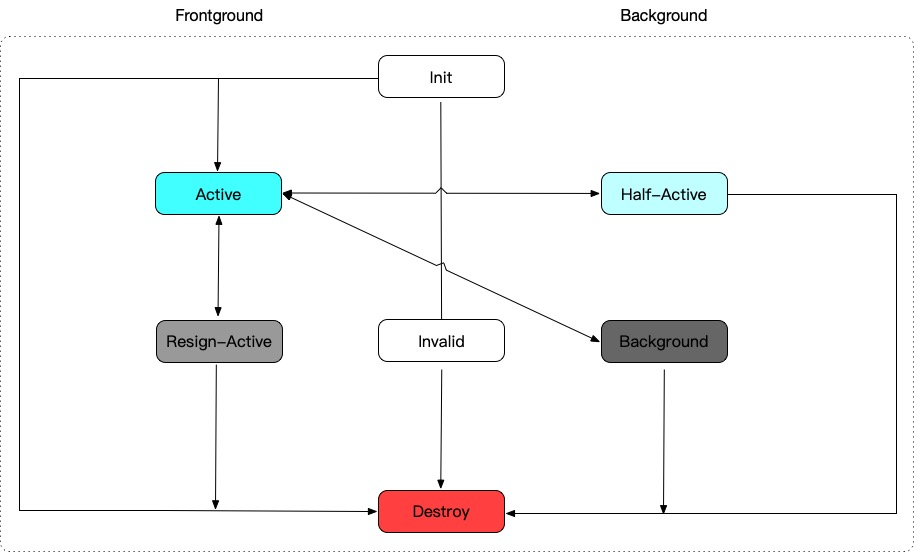

# 1. 小程序运行框架设计
## 1.1. 文档版本

|文档版本|修改日期|修改概述|
|:--|:--|:--|
|0.8|2018-12-19|初始版本|
|0.9|2019-03-12|更新运行时框架|

## 1.2. 小程序架构图
基于小程序所在的运行时依赖于宿主的程序环境，在iOS上，小程序是与宿主APP是同一个进程下运行。小程序之间的资源共享、调度，在单进程下就会面临资源窜用、端能力调用异常等问题，为了更好地隔离小程序与小程序之间的关系，小程序运行时分为swanOS runtime和swanapp runtime。小程序整体架构图：

 1. swanOS runtime负责维护所有小程序运行时的生命周期、小程序的对象池管理；
 2. swanapp runtime依赖状态机维护小程序的运行状态，页面栈管理、事件派发；
 
-----

## 1.3. swanOS runtime启动顺序图

 start：负责swanCore的preload、downloader任务;
 swanApp管理：app的launch、unload、clear、appQueue操作；
 notification: 接收iOS系统通知、swanApp的通知事件；
 
## 1.4. swanapp runtime life-cycle

根据小程序在手百下运行的显隐状态分：FrontgroundDisplay、BackgroundDisplay；
小程序运行时的生命周期，分为7种状态：

 1. Init：小程序处于初始化加载中状态，swanCore 加载，业务包下载、加载，可以在FrontgroundDisplay、BackgroundDisplay；
 2. Active：小程序在前台时，已经加载完成，小程序在当队列中只有一个小程序处于Active状态；
 3. Half-active：小程序由Active状态转为Half-active状态，比如：播放一个后台音频任务；
 4. Resign-active：当前小程序在FrontgroundDisplay时，当前小程序被下一个小程序盖住，此时当前小程序由Active状态转为Resign-active状态；
 5. Background：小程序退出导航栈时，变为BackgroundDisplay状态，由Active状态转为Background状态；
 6. Invaild：小程序处于异常状态，随时会被小程序队列清除；
 7. Destroy：小程序进入销毁状态。