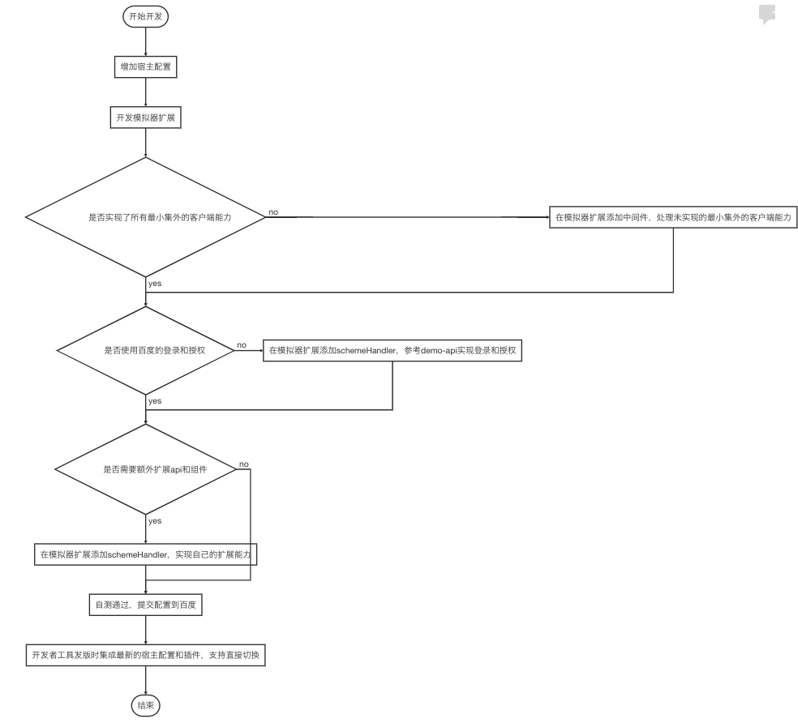

# 开发者工具宿主接入文档

## 快速开始

要实现一个新的APi,需要在开发者工具模拟器扩展中添加一个api的实现,同时在框架的 extensionJs 中添加一个新的api描述。下面简述如何快速添加一个api

- 安装百度提供的开发者工具安装包
<<<<<<< HEAD
- 下载文档内的[demo示例工程](assets/hosts.zip)
- 打开开发者工具, ${hostPath} 是demo解压后的目录
    - mac系统在终端中使用下面的命令,
    `/Applications/百度开发者工具-host.app/Contents/MacOS/百度开发者工具-beta --host ${hostPath} --console`
    - windows系统在cmd中使用命令 `%USERPROFILE%\AppData\Local\Programs\swan-ide-gui\百度开发者工具-beta.exe --host ${hostPath} --console` ,
    也可以使用快捷方式,在后面添加--host ${hostPath} --console参数启动工具
- 打开 ${hostPath}/demo/program/simulator-extensions/demo-api/master.js文件,这个是api能力的native实现部分。  
~~todo api没有实现schememap,这个还做不了,实现方式待确认。。。~~

=======
- 打开百度开发者工具文件代码目录。
   - mac系统文件位置`/Applications/百度开发者工具-host.app/Contents/Resources/app`,
   - windows系统文件位置`%USERPROFILE%\AppData\Local\Programs\swan-ide-gui\resources\app`
- 打开代码目录下extensions/demo-api/master.js文件,这个是api能力的native实现部分。  
~~todo api没有实现schememap,这个还做不了,实现方式待确认。。。~~

>>>>>>> 461852091cac109103e658ed734ab78c3dd1ae36
- 修改schemeHandlers部分的代码,添加下面内容 
    
        // schemeHandlers的key部分,是对应api scheme的action部分,当需要新增api时,添加一个对应的api实现即可。
        // key的取值见下面的extensionJs的描述
        schemeHandlers: {
            ...handlers,
            demo: context => async ({query: {params: {data, cb}}}) => {
                context.utils.execute(cb, 0, 'success', data);
            }
        }
        
        // middleWares提供对所有native能力的统一前置处理,这里可以方便的处理没实现的最小集
        middleWares: [
            context => next => async scheme => {
                switch (scheme.action) {
                    case 'chooseInvoiceTitle':
                    case 'chooseAddress':
                    case 'requestPolymerPayment':
                        context.event.send(
                            'inspector.loggerToConsole',
                            {
                                level: 'error',
                                value: `在demo宿主中,不支持${scheme.action}`
                            }
                        );
                        break;
                    default:
                        return next(scheme);
                }
            }
        ],
        
- 在 ~/.swan-cli/vendor/demo_extension/1.0.2目录,extension.js中,修改前端框架extensionJs的实现,代码内添加demo:

        
        // 宿主名称,也是api的命名空间,在此文件内的api会以swan.demo.xxx的方式调用
        name: 'demo',
        // hostMethodDescriptions是api的参数描述,name就是上面schemeHandlers中的key字段,也是middleWares里scheme的action
        hostMethodDescriptions: [{
            name: 'demo',
            args: [
                {name: 'data', value: 'Object='},
                {name: 'cb', value: 'string'}
            ]
        }],
        // methods是暴露给开发者的方法名,即swan.demo.xxx的xxx部分
        // methods下的key和schemeHandlers的key不要求一致,比如下面的demo、demo1都会调用action是demo的api实现
        methods: {
            demo: function (obj) {
                // boxjs.demo 这个demo部分对应的就是scheme的action name,也就是hostMethodDescriptions里面的name字段
                return boxjs.demo({
                    data: obj.data || {},
                    cb: createCb(obj)
                });
            },
            demo1: function (obj) {
                return boxjs.demo({
                    data: obj.data || {},
                    cb: createCb(obj)
                });
            }
        }
    

- 打开一个小程序工程,点击工具栏切换宿主按钮,切换到demo宿主
- 重新打开工程,等待编译完成后,在调试器console中输入`swan.demo.demo({data:{test: 1},success:console.log})`,可以看到输出了api中返回的内容。

## 接入流程图
<<<<<<< HEAD
- 
=======
- 
>>>>>>> 461852091cac109103e658ed734ab78c3dd1ae36
## 详细说明 
   - [如何开发和调试](开发和调试.md)
   - [如何增加宿主配置](增加宿主配置.md)
   - [如何开发模拟器扩展](开发模拟器扩展.md)
   - [使用demo-api](demo-api.md)
 

