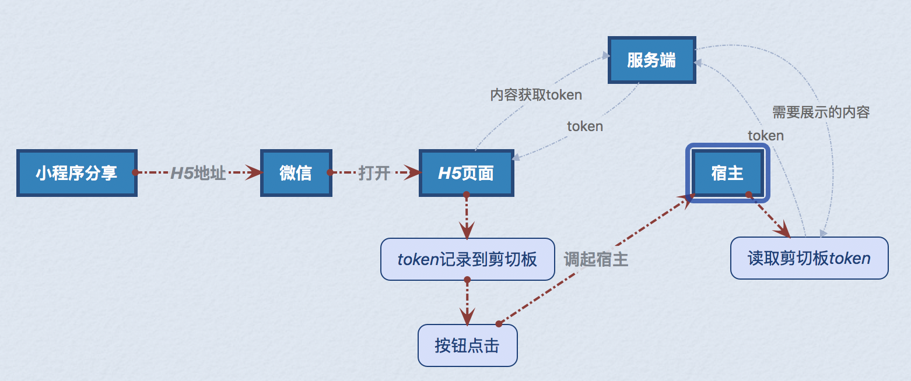

# 分享
> 本节介绍了分享的逻辑和具体的实现方法。

当小程序被分享出去后，默认被分享的是一个百度域的H5页面，当用户点击 H5 页面中按钮的时候，开始调起手百的逻辑。手百被调起后，根据 token 再打开对应的小程序。默认的回流页面逻辑如下：

#### H5 页面：
由于大部分浏览器都有对于外部调起屏蔽的策略。所以，回流页面中并没有直接调起手百，而是展示了一个调起手百的按钮。

#### token 获取时机：
当用户点击 H5 回流页面的按钮之后，先是使用`ClipboardJS`将一段从服务端获取的 token 粘贴到用户的剪贴板，然后尝试调起手百。

#### 调起后的展示：
调起手百后，手百从剪贴板里获取信息，然后正则匹配出指定的字符串，发送到服务端校验，解析服务器返回的数据，如果有对应的需要展示的数据，弹出手百口令弹窗。否则什么都不做。

## 宿主页面可行方案

对于宿主，如果使用自己的回流页面则可以使用上述方式：

1. 在 extension 中定义自定义回流页的链接 参考 [extension扩展](../前端swan.js接入/如何进行扩展.md)；
2. 搭建口令验证服务器；
3. 在分享出去的链接页面被打开后，调起宿主 App 前，在页面中请求服务器换取口令，并粘贴到剪贴板；
4. 在宿主客户端被打开后，宿主客户端获取剪贴板中的内容，匹配一下其中是否有口令内容，宿主客户端使用该口令发回自己的口令服务器进行校验；
5. 如果校验通过宿主客户端则打开之前准备调起的小程序。