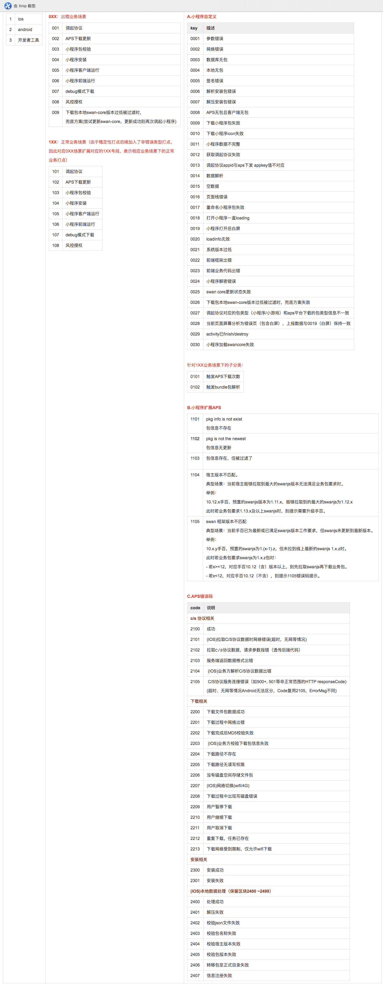

# 【调起小程序协议】开源

# 1、  前言
小程序各端代码开源后，会接入不同宿主，使小程序可以在各个宿主上正常运行
。
调起小程序的协议也是开源的一部分，协议的一部分，宿主使用该协议该协议时，协议头需要使用宿主本身的，并且协议中不能包含与手百强关联的信息。
。

# 1.1、  名词解释
- `各端`：包括小程序前端框架swanjs，ios和android，小程序工具
- `宿主`：指可以运行百度智能小程序的app，例如：贴吧，b站等
- `协议头`：协议头为app的唯一调用标识调用标识

# 2、 协议规范

> schemeHead://swan/{appKey}/pages/home/home/?a=aa&b=bb&_hostPrivateInfo=encodeURIComponent(JSON.stringify({from: '1001', ext: {}}))

# 2.1、 结构

 - **解释**
`schemeHead`为协议头，每个宿主需要使用自己的。
例如百度是：baiduboxapp，贴吧是：tiebaclient。
后面紧跟着`://`这个是固定不变且必须的。

 - **解释**
`swan/{appKey}/`其中，swan代表小程序，这个是固定不变的。
{appKey}是小程序的唯一标识，在b端申请小程序时，会产生appkey。每个小程序是不一样的。

	开发者工具生成的appkey，会带dev标识规则，如: TZzPY8qVvX97uzIH4L2SnY0g_dev123，其中123为自增数字，每次在工具中点预览按钮，生成二维码时，数字会自增。具体数字在工具中获取

 - **解释**
 `/pages/home/home/`这个为调起小程序后打开的页面，非必填，默认打开首页。
 
 - **解释**
`a=aa&b=bb`这个为调起小程序时，打开的页面时需要传递的query信息，非必填，值需要encodeURIComponent。可在小程序App的onshow、onLaunch获取到。

 - **解释**
`_hostPrivateInfo`这个是给宿主用的，用来传递一些信息到宿主端里，但不会透传给小程序，例如：渠道号等。

# 2.2、 保留字
在协议拼接的query中，不能使用以下保留字段：
- baiduboxapp
- _baiduboxapp
- callback
- upgrade
- slog
- caller
- next
- prev
- delaytime
- appid
- appId
- aey
- appkey
- entry
- loading
- senior
- oauthType
- app
- website
- smartapp

# 2.3、 小程序错误码对照表

